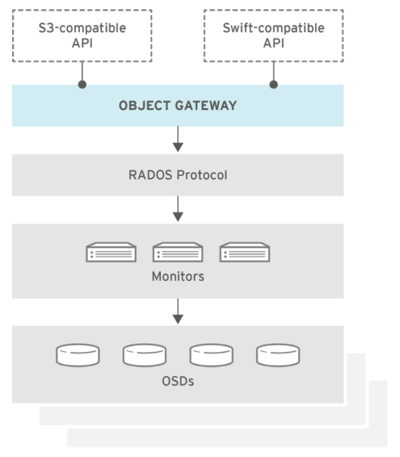

## 1. Overview
Ceph Object Gateway, hay còn được gọi là RADOS Gateway (RGW) là nơi giao tiếp với Object Storage, được xây dựng ở lớp trên `librados` để cung cấp ứng dụng với RESTful Gateway đến hạ tầng Ceph Cluster. Ceph Object gateway hỗ trợ 2 giao diện kết nối:
- S3-compatible: Cung cấp chức năng lưu trữ object storage với giao diện thích hợp Amazon S3 RESTful API.
- Swift-compatible: Cung cấp chức năng lưu trữ object storage với giao diện thích hợp OpenStack Swift API.

Ceph Object Gateway là một server tương tác với hạ tầng Ceph Cluster. Từ khi cung cấp giao diện tương thích với Openstack Swift và Amazon S3, Ceph Object Gateway có user quản lý riêng.

Ceph Object gateway có thể lưu dữ liệu cùng lúc với việc lưu dữ liệu vào block của người dùng. cho dù vậy, vẫn cần tiến tới chia tách các pool và sử dụng các lớp CRUSH khác nhau cho từng chức năng.

S3 và Swift APIs sử dụng chung một namespace, vậy nên bạn có thể ghi dữ liệu với một loại API và đọc dữ liệu đó với API khác.



## 2. Cấu hình

### 2.1 CivetWeb front end

Mặc định, Ceph Object Gateway đưa giao diện tương tác RESTful thông HTTP sử dụng CivetWeb server. CivetWeb là webserver nhúng C/C++.

Tài liệu tham khảo: [CivetWeb on Github](https://github.com/civetweb/civetweb)

### 2.2. Changing the CivetWeb port

Khi Ceph Object Gateway được cài đặt bởi Ansible thì CivetWeb chạy trên port 8080. Ansible cấu hình bằng cách thêm dòng sau vào file `ceph.conf`:
```ini
rgw frontends = civetweb port=192.168.122.199:8080 num_threads=100
```

**Lưu ý**
Nếu trong file `ceph.conf` không có cấu hình `rgw frontends = civetweb`, Ceph Object Gateway sẽ chạy port 7480. Nếu có dòng `rgw frontends = civetweb` nhưng lại không chỉ định `port` thì Ceph Object Gateway sẽ chạy port 80

**Phương thức cấu hình**
1. Phải được thực hiện trên Gateway node, cấu hình Ceph thông qua file `/etc/ceph/ceph.conf`:

2. Tìm mục RGW hoặc bổ sung theo hướng dẫn dưới đây:
```ini
[client.rgw.gateway-node1]
host = gateway-node1
keyring = /var/lib/ceph/radosgw/ceph-rgw.gateway-node1/keyring
log file = /var/log/ceph/ceph-rgw-gateway-node1.log
rgw frontends = civetweb port=192.168.122.199:8080 num_threads=100
```

Mục `[client.rgw.gateway-node1]` xác định các phần dưới đây sẽ cấu hình Ceph Object Gateway bằng `rgw` và tên của node làm gateway `gateway-node1`

3. Để thay đổi cấu hình port mặc định của Ansible thì chỉnh sửa dòng dưới:
```ini
rgw frontends = civetweb port=192.168.122.199:80 num_threads=100
```
Chắc chắn không có khoảng trắng giữa `port=port-number`