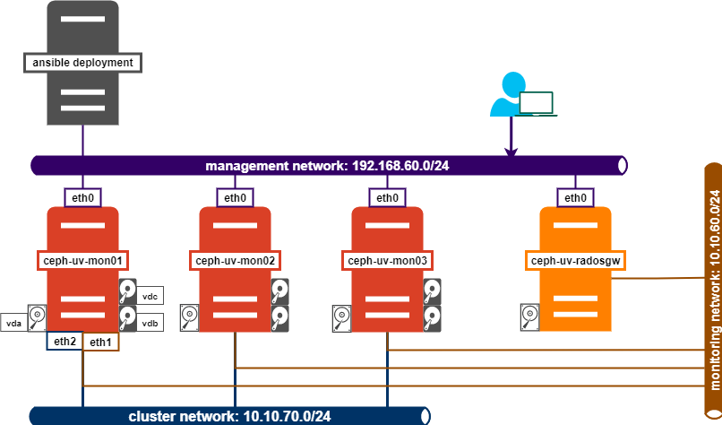

# Install CEPH-Cluster


## 1. Chuẩn bị
- 5 nodes: ansible-deployment, ceph-uv-mon01, ceph-uv-mon02, ceph-uv-mon03, ceph-uv-mon03, ceph-uv-radosgw.
- HĐH: Ubuntu 20.04
- Interfaces: eth0 (192.168.10.0/24), eth1 (10.10.60.0/24), eth2 (10.10.70.0/24)
- Mỗi node mon có 3 ổ: vda( dùng cài os), vdb, vdc

## 2. Thành phần và mô hình
- **Phiên bản CEPH**: Pacific
- **mons**: ceph-uv-mon01, ceph-uv-mon02, ceph-uv-mon03, ceph-uv-mon03
- **mgrs**: ceph-uv-mon01, ceph-uv-mon02, ceph-uv-mon03, ceph-uv-mon03
- **osds**: ceph-uv-mon01, ceph-uv-mon02, ceph-uv-mon03, ceph-uv-mon03
- **rgws**: ceph-uv-radosgw
- **grafana-server**: ceph-uv-mon01




## 3. Triển khai
### 3.1 Cài đặt cơ bản
*Thực hiện trên các node trong cụm cluster*
- Update các gói phần mềm:
```sh
apt -y update && apt -y upgrade
```

- Khởi động lại máy:
```sh
init 6
```

### 3.2 Thiết lập Ceph Ansible
- Sao chép ssh public key đến các node trong cụm CEPH:
```sh
ssh-copy-id root@192.168.60.74
ssh-copy-id root@192.168.60.253
ssh-copy-id root@192.168.60.139
ssh-copy-id root@192.168.60.206
```

- Clone repository từ github về
```sh
git clone https://github.com/ceph/ceph-ansible.git
```

- Truy cập vào thư mục và chọn nhánh:
```sh
cd ceph-ansible
git checkout stable-6.0
```
- Nếu chưa cài đặt Ansible thì chạy lệnh cài đặt phiên bản ansible tối thiểu cho phiên bản ceph-ansible này:
```sh
apt install -y python3-pip
pip install -r requirements.txt
```
- Copy playbook và file biến group_vars:
```sh
cp site.yml.sample site.yml
cp group_vars/all.yml.sample group_vars/all.yml
```

- Tạo file Inventory
```sh
cat << EOF > ceph_inventory
[mons]
ceph-uv-mon01 ansible_host=192.168.60.74
ceph-uv-mon02 ansible_host=192.168.60.253
ceph-uv-mon03 ansible_host=192.168.60.139

[osds]
ceph-uv-mon01 ansible_host=192.168.60.74
ceph-uv-mon02 ansible_host=192.168.60.253
ceph-uv-mon03 ansible_host=192.168.60.139


[mgrs]
ceph-uv-mon01 ansible_host=192.168.60.74
ceph-uv-mon02 ansible_host=192.168.60.253
ceph-uv-mon03 ansible_host=192.168.60.139

[rgws]
ceph-uv-radosgw ansible_host=192.168.60.206

[monitoring]
ceph-uv-mon01 ansible_host=192.168.60.74

EOF
```
- Chỉnh sửa file biến `group_vars/all.yml`, thêm các dòng sau:
```yml
ceph_origin: repository
ceph_repository: community
ntp_service_enabled: true
ceph_stable_release: pacific
# Khai bao dai Ceph_OpenStack VLAN
ceph_openstack_network: 10.10.60.0/24
# Khai bao dai Ceph_Replicate VLAN
ceph_replicate_network: 10.10.70.0/24
monitor_address_block: "{{ ceph_openstack_network }}"
dashboard_network: "192.168.60.0/24"
public_network: "{{ ceph_openstack_network }}"
cluster_network: "{{ ceph_replicate_network }}"
devices:
  - '/dev/vdb'
  - '/dev/vdc'
osd_objectstore: bluestore
crush_device_class: ssd

dashboard_enabled: yes
configure_firewall: no
openstack_config: no

radosgw_interface: "eth0"

ceph_conf_overrides:
 global:
   osd_pool_default_size: 1
   osd_pool_default_min_size: 1
   osd_pool_default_pg_num: 128

dashboard_protocol: http
dashboard_port: 8080
dashboard_admin_user: admin
dashboard_admin_password: VinhDucNguyen1998
grafana_admin_password: VinhDucNguyen1998

mon_osd_full_ratio: .90
mon_osd_nearfull_ratio: .70
multi_osd_backend: no
ceph_conf_local: true
journal_size: 20480
```

- Thực hiện chạy lệnh dưới đây để triển khai hệ thống:
```sh
ansible-playbook -i ceph_inventory site.yml -u root
```
- Sau khi cài đặt xong, sử dụng lệnh `ceph -s` sẽ có thông báo `mons are allowing insecure global_id reclaim`, sử dụng lệnh sau để loại bỏ check insecure:
```sh
ceph config set mon auth_allow_insecure_global_id_reclaim false
```
*Tại mục 4 tôi sẽ thêm cấu hình này vào trong config*

- Kết quả:
```sh
root@ceph-uv-mon01:~# ceph -s
  cluster:
    id:     5970b0db-c67a-4fec-97ca-ff27c5384a37
    health: HEALTH_OK

  services:
    mon: 3 daemons, quorum ceph-uv-mon03,ceph-uv-mon01,ceph-uv-mon02 (age 3h)
    mgr: ceph-uv-mon01(active, since 3h), standbys: ceph-uv-mon03, ceph-uv-mon02
    osd: 6 osds: 6 up (since 3h), 6 in (since 3h)

  data:
    pools:   5 pools, 105 pgs
    objects: 16 objects, 1.8 KiB
    usage:   282 MiB used, 180 GiB / 180 GiB avail
    pgs:     105 active+clean
```


## 4. Chỉnh sửa playbook CEPH cho phù hợp với môi trường
*Tại phần này chỉ mang tính chất tham khảo, tôi sẽ sửa playbook Ceph Ansible, loại bỏ các phần thừa để phù hợp với môi trường của tôi hơn*

---
## Tham khảo

[1] https://docs.ceph.com/projects/ceph-ansible/en/latest/

