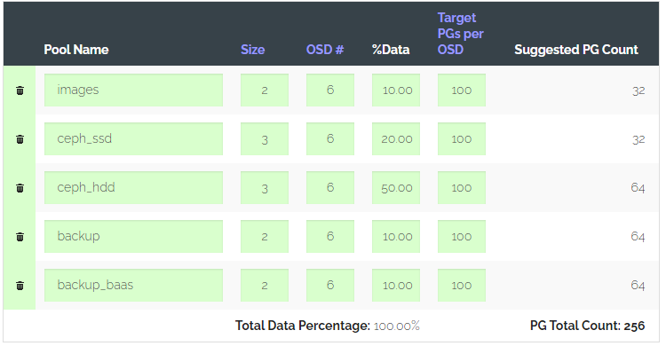

# Hướng dẫn cài đặt hạ tầng CEPH Cluster sử dụng khác hạ tầng network

*Bài toán: Thêm các node OSD vào hạ tầng CEPH Cluster nhưng khác hạ tầng network (có dải mạng cluster và public khác với hệ thống đã có sẵn)*

*Đây là phương án cấu hình triển khai xôi thịt (fix cứng trong ceph.conf) chưa được tối ưu =)) , Centos8 Linux đã EOL.*

*Cài đặt CEPH cluster bằng CEPH-Ansible.*

## 1. Mô hình hệ thống triển khai 


**Mô tả hệ thống:**
- Hệ thống CEPH ban đầu:
    - ceph-ms-mon
    - ceph-ms-osd01
    - Sử dụng network `public_network01` và `private_network01`

- Hệ thống CEPH bổ sung:
    - ceph-ms-osd02
    - Sử dụng network `public_network02` và `private_network02`
    - `Router_CEPH_public` để route dải `public_network01` và `public_network02`
    - `Router_CEPH_cluster` để route dải `private_network01` và `private_network02`

- Dải `management` là dải kết nối đến các máy chủ để chạy Ansible (trong thực tế có thể bị tách ra).

**Thông tin cấu hình:**
- Hệ điều hành: Centos8
- Cấu hình chung: 2 core, 6GB RAM
- Mỗi máy chủ gắn thêm 2 disk (`vdb, vdc`) có dung lượng 30GB
- Mỗi máy có 3 NIC (`eth0, eth1, eth2`)

## 2. Cấu hình Route
### 2.1 Cấu hình cho các máy chủ hệ thống ban đầu

*Trên ceph-ms-mon và ceph-ms-osd01*

- Cấu hình route cho dải private network
```sh
cat << EOF > /etc/sysconfig/network-scripts/route-eth2
10.10.44.0/24 via 10.10.43.1 dev eth2
EOF
```

- Cấu hình route cho dải public network
```sh
cat << EOF > /etc/sysconfig/network-scripts/route-eth1
10.10.42.0/24 via 10.10.41.1 dev eth1
EOF
```
### 2.2 Cấu hình cho các máy chủ hệ thống bổ sung

*Trên ceph-ms-osd02*
- Cấu hình route cho dải private network
```sh
cat << EOF > /etc/sysconfig/network-scripts/route-eth2
10.10.43.0/24 via 10.10.44.1 dev eth2
EOF
```

- Cấu hình route cho dải public network
```sh
cat << EOF > /etc/sysconfig/network-scripts/route-eth1
10.10.41.0/24 via 10.10.42.1 dev eth1
EOF
```

## 3. Chuyển CentOS Linux sang Centros Stream
*Thực hiện trên tất cả máy chủ*

- Disable các mirror của repo Centos Linux cũ:
```sh
sed -i 's/mirrorlist/#mirrorlist/g' /etc/yum.repos.d/CentOS-Linux-*
sed -i 's|#baseurl=http://mirror.centos.org|baseurl=http://vault.centos.org|g' /etc/yum.repos.d/CentOS-Linux-*
```

- Cài đặt CentOS Stream repository:
```sh
sudo dnf install centos-release-stream
```

*Nếu không cài đặt được thì tải [tại đây](http://mirror.centos.org/centos/8/extras/x86_64/os/Packages/centos-release-stream-8.1-1.1911.0.7.el8.x86_64.rpm) sau đó dùng lệnh `rpm -ivh` để cài đặt*

- Thay thế toàn bộ repository cảu CentOS Linux thành CentOS Stream:
```sh
sudo dnf swap centos-{linux,stream}-repos
```

- Chạy Migrate CentOS Linux8 thành CentOS Stream 8
```sh
sudo dnf distro-sync
```

## 4. Cấu hình Ansible
*Thực hiện trên máy chủ chạy ansible*
### 4.1 Cấu hình file Inventory
- Cấu hình file inventory của Ansible:
```ini
[mons]
ceph-ms-mon ansible_host=192.168.50.37 ansible_port=22
 
[mgrs]
ceph-ms-mon ansible_host=192.168.50.37 ansible_port=22

[osds]
ceph-ms-mon ansible_host=192.168.50.37 ansible_port=22
ceph-ms-osd01 ansible_host=192.168.50.23 ansible_port=22
ceph-ms-osd02 ansible_host=192.168.50.33 ansible_port=22
```

### 4.2 Chỉnh sửa cấu hình Ansible
- Chỉnh sửa file template cấu hình `ceph.conf` tại `roles/ceph-config/templates/ceph.conf.j2`
```ini
#...
[global]
#...
public network = {{ public_network }}
#...
cluster network = 10.10.41.0/24 [, 10.10.42.0/24]
cluster_addr = {{ ansible_eth1.ipv4.address }}
#...
```
- Chỉnh sửa file biến để tạo pool
```yml
# Khai bao cac pool can tao
create_pools:
  - "{{ images }}"
  - "{{ volumes_hdd }}"
  - "{{ backups_baas }}"
  - "{{ volumes_ssd }}"
  - "{{ backups }}"

# Khai bao thong tin chi tiet cho cac pool tren
images:
  name: "images"
  pg_num: 32
  pgp_num: 32
  rule_name: "ceph_hdd"
  type: 1
  erasure_profile: ""
  expected_num_objects: ""
  application: "rbd"
  size: 2
  min_size: 1
  pg_autoscale_mode: False
volumes_hdd:
  name: "volumes_hdd"
  pg_num: 64
  pgp_num: 64
  rule_name: "ceph_hdd"
  type: 1
  erasure_profile: ""
  expected_num_objects: ""
  application: "rbd"
  size: 3
  min_size: 1
  pg_autoscale_mode: False
volumes_ssd:
  name: "volumes_ssd"
  pg_num: 64
  pgp_num: 64
  rule_name: "ceph_hdd"
  type: 1
  erasure_profile: ""
  expected_num_objects: ""
  application: "rbd"
  size: 3
  min_size: 1
  pg_autoscale_mode: False
backups:
  name: "backups"
  pg_num: 32
  pgp_num: 32
  rule_name: "ceph_hdd"
  type: 1
  erasure_profile: ""
  expected_num_objects: ""
  application: "rbd"
  size: 2
  min_size: 1
  pg_autoscale_mode: False
backups_baas:
  name: "backups_baas"
  pg_num: 32
  pgp_num: 32
  rule_name: "ceph_hdd"
  type: 1
  erasure_profile: ""
  expected_num_objects: ""
  application: "rbd"
  size: 2
  min_size: 1
  pg_autoscale_mode: False
```
*Tính PG theo https://old.ceph.com/pgcalc/*



### 4.3 Thực hiện triển khai Ceph-Ansible
- Copy SSH key cho các máy chủ trên hệ thống:
```sh
ssh-copy-id root@192.168.50.37
ssh-copy-id root@192.168.50.23
ssh-copy-id root@192.168.50.33
```

- Triển khai hệ thống CEPH:
```sh
ansible-playbook -i inventory_ceph_vinh playbook.yml -e@extra_vars/extra_vars_ntl2.yml
```

- Tạo keyring:
```sh
ansible-playbook -i inventory_ceph_vinh infrastructure-playbooks/add-pool.yml -e@extra_vars/extra_vars_ntl2.yml -e@infrastructure-playbooks/customise_ntl2.yml
```

- Tạo crush rule:
```sh
ansible-playbook -i inventory_ceph_vinh infrastructure-playbooks/add-crushrules.yml -e@extra_vars/extra_vars_ntl2.yml -e@infrastructure-playbooks/customise_ntl2.yml
```

- Tạo pool:
```sh
ansible-playbook -i inventory_ceph_vinh infrastructure-playbooks/add-pool.yml -e@extra_vars/extra_vars_ntl2.yml -e@infrastructure-playbooks/customise_ntl2.yml
```
## Kiểm tra sau cài đặt

- Kiểm tra trạng thái hệ thống CEPH:
```sh
ceph -s
```
- Kiểm tra các OSD đã up:
```sh
ceph osd tree
```

- Thực hiện đẩy object vào CEPH Cluster (mong muốn: dữ liệu được lưu replicate trên tất cả osd):
```sh
rados -p volumes_hdd put myobject-1 <file_name>
```
- Kiểm tra dữ liệu usage trên các OSD:
```sh
ceph osd df
```

---
## Tham khảo 

[1] https://network.nvidia.com/related-docs/whitepapers/WP_Deploying_Ceph_over_High_Performance_Networks.pdf

[2] https://docs.ceph.com/en/latest/rados/configuration/network-config-ref/

[3] https://www.reddit.com/r/ceph/comments/94bk97/ceph_cluster_on_two_nonoverlaping_networks/