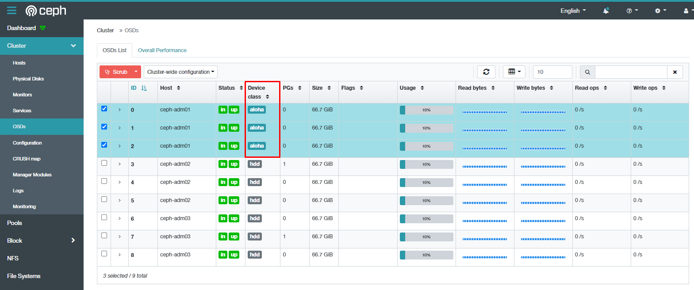

# Build Container Image for Cephadm

Khi cài hệ thống Ceph cluster bằng công cụ Cephadm, ta sẽ thấy hệ thống được xây dựng bằng các container image có tên `quay.io/ceph/ceph`. Các image này được pull từ registry [quay.io](https://quay.io/repository/ceph/ceph?tab=tags). 

*Nếu:*
**"Tôi muốn sửa code cephadm để triển khai chỉ định device_class!"**

Vậy muốn sửa code của [ceph](https://github.com/ceph/ceph) thì ta cần phải build lại image của ceph.

Khi pull image từ [quay.io](https://quay.io/repository/ceph/ceph?tab=tags) sau đó thực hiện lệnh:
```sh
docker inspect <image_id>
```
Ta sẽ thấy kết quả dưới đây:
```json

[
    {
        "RepoTags": [
            "quay.io/ceph/ceph:v16",
            "quay.io/ceph/ceph:v16.2.10"
        ],
        "RepoDigests": [
            "quay.io/ceph/ceph@sha256:c5fd9d806c54e5cc9db8efd50363e1edf7af62f101b264dccacb9d6091dcf7aa"
        ],
        "Parent": "",
        "Comment": "",
        "Created": "2022-08-04T16:03:05.045219204Z",
        "Container": "14ecf3799ae0a9ab300049aca4e1eb511aa78a53bb58d600a9ae421a7e1dddc6",
        "ContainerConfig": {
            "Hostname": "7323ecf6dc56",
            "Domainname": "",
            "User": "",
            "AttachStdin": false,
            "AttachStdout": false,
            "AttachStderr": false,
            "Tty": false,
            "OpenStdin": false,
            "StdinOnce": false,
            "Env": [
                "PATH=/usr/local/sbin:/usr/local/bin:/usr/sbin:/usr/bin:/sbin:/bin",
                "container=oci",
                "I_AM_IN_A_CONTAINER=1",
                "CEPH_VERSION=pacific",
                "CEPH_POINT_RELEASE=-16.2.10",
                "CEPH_DEVEL=false",
                "CEPH_REF=pacific",
                "OSD_FLAVOR=default"
            ],
            "Image": "sha256:0dbaab9c93477b75d223fc76cc35ceeee733d9bcf56977a547d7908f42fc47d4",
            "Volumes": {},
            "WorkingDir": "",
            "Entrypoint": null,
            "OnBuild": [],
            "Labels": {
                "CEPH_POINT_RELEASE": "-16.2.10",
                "GIT_BRANCH": "HEAD",
                "GIT_CLEAN": "True",
                "GIT_COMMIT": "3ba0f095be759493a04a571a28c5ba53112cd5d3",
                "GIT_REPO": "https://github.com/ceph/ceph-container.git",
                "RELEASE": "HEAD",
                "architecture": "x86_64",
                "build-date": "2022-07-26T12:34:08.928083",
                "ceph": "True",
                "com.redhat.build-host": "cpt-1008.osbs.prod.upshift.rdu2.redhat.com",
                "com.redhat.component": "centos-stream-container",
                "com.redhat.license_terms": "https://centos.org/legal/licensing-policy/",
                "description": "CentOS Stream is a continuously delivered distro that tracks just ahead of Red Hat Enterprise Linux development. This image takes the Red Hat UBI and layers on content from CentOS Stream",
                "distribution-scope": "public",
                "io.buildah.version": "1.19.8",
                "io.k8s.description": "The Universal Base Image is designed and engineered to be the base layer for all of your containerized applications, middleware and utilities. This base image is freely redistributable, but Red Hat only supports Red Hat technologies through subscriptions for Red Hat products. This image is maintained by Red Hat and updated regularly.",
                "io.k8s.display-name": "CentOS Stream 8",
                "io.openshift.expose-services": "",
                "io.openshift.tags": "base centos centos-stream",
                "maintainer": "Guillaume Abrioux <gabrioux@redhat.com>",
                "name": "centos-stream",
                "release": "903",
                "summary": "Provides a CentOS Stream container based on the Red Hat Universal Base Image",
                "url": "https://access.redhat.com/containers/#/registry.access.redhat.com/ubi8/images/8.6-903",
                "vcs-type": "git",
                "vendor": "Red Hat, Inc.",
                "version": "8"
            }
        },
        "DockerVersion": "20.10.7",
        "Author": "",
        "Config": {
            "Domainname": "",
            "User": "",
            "AttachStdin": false,
            "AttachStdout": false,
            "AttachStderr": false,
            "Tty": false,
            "OpenStdin": false,
            "StdinOnce": false,
            "Env": [
                "PATH=/usr/local/sbin:/usr/local/bin:/usr/sbin:/usr/bin:/sbin:/bin",
                "container=oci",
                "I_AM_IN_A_CONTAINER=1",
                "CEPH_VERSION=pacific",
                "CEPH_POINT_RELEASE=-16.2.10",
                "CEPH_DEVEL=false",
                "CEPH_REF=pacific",
                "OSD_FLAVOR=default"
            ],
            "Cmd": [
                "/bin/bash"
            ],
            "ArgsEscaped": true,
            "Image": "sha256:0dbaab9c93477b75d223fc76cc35ceeee733d9bcf56977a547d7908f42fc47d4",
            "Volumes": {},
            "WorkingDir": "",
            "Entrypoint": [],
            "OnBuild": [],
            "Labels": {
                "CEPH_POINT_RELEASE": "-16.2.10",
                "GIT_BRANCH": "HEAD",
                "GIT_CLEAN": "True",
                "GIT_COMMIT": "3ba0f095be759493a04a571a28c5ba53112cd5d3",
                "GIT_REPO": "https://github.com/ceph/ceph-container.git",
                "RELEASE": "HEAD",
                "architecture": "x86_64",
                "build-date": "2022-07-26T12:34:08.928083",
                "ceph": "True",
                "com.redhat.build-host": "cpt-1008.osbs.prod.upshift.rdu2.redhat.com",
                "com.redhat.component": "centos-stream-container",
                "com.redhat.license_terms": "https://centos.org/legal/licensing-policy/",
                "description": "CentOS Stream is a continuously delivered distro that tracks just ahead of Red Hat Enterprise Linux development. This image takes the Red Hat UBI and layers on content from CentOS Stream",
                "distribution-scope": "public",
                "io.buildah.version": "1.19.8",
                "io.k8s.description": "The Universal Base Image is designed and engineered to be the base layer for all of your containerized applications, middleware and utilities. This base image is freely redistributable, but Red Hat only supports Red Hat technologies through subscriptions for Red Hat products. This image is maintained by Red Hat and updated regularly.",
                "io.k8s.display-name": "CentOS Stream 8",
                "io.openshift.expose-services": "",
                "io.openshift.tags": "base centos centos-stream",
                "maintainer": "Guillaume Abrioux <gabrioux@redhat.com>",
                "name": "centos-stream",
                "release": "903",
                "summary": "Provides a CentOS Stream container based on the Red Hat Universal Base Image",
                "url": "https://access.redhat.com/containers/#/registry.access.redhat.com/ubi8/images/8.6-903",
                "vcs-type": "git",
                "vendor": "Red Hat, Inc.",
                "version": "8"
            }
        },
]
```
Ta có thể thấy một vài thông tin như:
- Repo tag: quay.io/ceph/ceph:v16.2.10
- Các biến truyền vào lúc build image: CEPH_POINT_RELEASE=-16.2.10,CEPH_VERSION=pacific, CEPH_DEVEL=false,...
- **Image được build từ nguồn**: https://github.com/ceph/ceph-container.git
- **Phiên bản os**: CentOS Stream 8
- Maintainer: Guillaume Abrioux <gabrioux@redhat.com>

Vậy ta đã biết source code build Image cho ceph tại [ceph-container](https://github.com/ceph/ceph-container.git)

## Ceph-container

Đây là repo chứa Dockerfile và các script để đưa Ceph vào trong container images.
Từ tháng 08 năm 2021, các container image của Ceph sẽ đề được đẩy lên registry quay.io. Docker hub sẽ không nhận được các bản cập nhật mới nhưng các image cũ trước đó sẽ vẫn còn.

Ubuntu container image cho Ceph không tồn tại. Chỉ còn support openSUSE và CentOS image.

Các container image của ceph đề được đặt tại [quay.io](https://quay.io/repository/ceph/ceph?tab=tags) và được đánh tag theo phiên bản tại [ceph](https://github.com/ceph/ceph) 

Ví dụ: tag [ceph-pacific-v16.2.10](https://github.com/ceph/ceph/tree/v16.2.10) đang là mới nhất của phiên bản Ceph Pacific.

### Development images

- Clone repo từ github:
```sh
git clone https://github.com/ceph/ceph-container
```
- Truy cập thư mục ceph-container
```sh
cd ceph-container
```


Khi build sẽ sinh ra 2 image: `daemon-base`(gói cài đặt cơ bản) và `daemon`. Thường ta sẽ sử dụng daemon-base.

Dockerfile có đường dẫn: `ceph-container/src/daemon-base/Dockerfile`

Các gói cài đặt của Image CentOS: `ceph-container/ceph-releases/ALL/centos/daemon-base/`

- Lệnh thực hiện build image:
```sh
make BASEOS_REGISTRY=quay.io/centos BASEOS_TAG=stream8 FLAVORS="pacific-16.2.10,centos,8" build
```

### Registry

Tôi có sử dụng máy chủ cài Harbor Registry để lưu image.
- Đăng nhập vào registry:
```sh
docker login registry.cloudvnpt.com
```

- Đổi tag của image vừa build:
```sh
docker tag ceph/daemon-base:main-pacific-centos-stream8-x86_64 registry.cloudvnpt.com/ceph/ceph:v16.2.10
```

- Push lên registry:
```sh
docker push registry.cloudvnpt.com/ceph/ceph:v16.2.10
```

### Upgrade Cephadm

- Để có thể pull image từ registry thì cần đăng nhập từ tất cả các máy chủ ceph.
```sh
docker login registry.cloudvnpt.com
```

- Thực hiện lệnh sau để upgrade image:
```sh
ceph orch upgrade start --image registry.cloudvnpt.com/ceph/ceph:v16.2.10
```

*Tôi đã update code và customize được device class trên cephadm*




