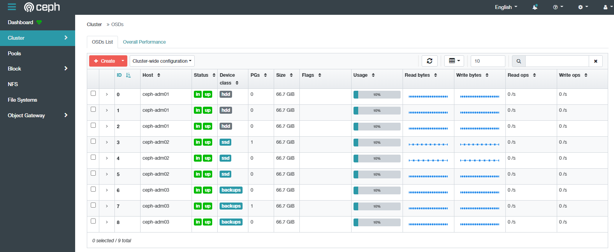

# Install Cephadm

## 1. Thiết lập ban đầu
*Thực hiện trên tất cả các máy chủ*
### Cài đặt cấu hình cơ bản
- Cấu hình file host
```sh
cat << EOF > /etc/hosts
192.168.60.111  10.10.1.111 ceph-adm01
192.168.60.112  10.10.1.112 ceph-adm02
192.168.60.113  10.10.1.113 ceph-adm03
EOF
```
- Cập nhật các package của hệ thống
```sh
apt-get -y update && apt-get -y upgrade
```

- Cài đặt các gói phụ trợ
```sh
apt-get -y install python3 python3-pip
```

- Khởi động lại máy chủ để lấy kernel mới
```sh
init 6
```

### Cài đặt Docker
- Cài đặt các gói phần mềm cơ bản
```sh
apt-get install -y ca-certificates curl gnupg lsb-release
```

- Tạo thư mục keyring cho repo
```sh
sudo mkdir -p /etc/apt/keyrings
```

- Dowload keyring của docker repo về máy chủ
```sh
curl -fsSL https://download.docker.com/linux/ubuntu/gpg | sudo gpg --dearmor -o /etc/apt/keyrings/docker.gpg

echo \
  "deb [arch=$(dpkg --print-architecture) signed-by=/etc/apt/keyrings/docker.gpg] https://download.docker.com/linux/ubuntu \
  $(lsb_release -cs) stable" | sudo tee /etc/apt/sources.list.d/docker.list > /dev/null
```
- Cập nhật lại repository
```sh
apt-get update -y
```

- Cài đặt docker
```sh
apt-get install -y docker-ce docker-ce-cli containerd.io docker-compose-plugin
```
Kiểm tra version:
```
docker --version
```

## 2. Cài đặt Cephadm
*Thực hiện trên node `ceph-adm01`*
- Cài đặt cephadm:
```
curl --silent --remote-name --location https://github.com/ceph/ceph/raw/pacific/src/cephadm/cephadm

chmod +x cephadm

./cephadm add-repo --release pacific

./cephadm install
```

- Kiểm tra path của cephadm:
```
which cephadm
```
- Kiểm tra version cephadm:
```
cephadm version
```
- Chi tiết option có thể tùy chỉnh bằng lệnh
```sh
cephadm --help
```

## 3. Cài đặt Ceph Cluster
*Thực hiện trên node `ceph-adm01`*

- Tạo thư mục chứa cấu hình ceph
```sh
mkdir -p /etc/ceph
```
- Thực hiện bootstrap máy chủ Ceph Mon đầu tiên
```sh
cephadm bootstrap --mon-ip 10.10.1.111 --cluster-network 10.10.2.0/24 --initial-dashboard-user admin --initial-dashboard-password "Vnpt2022" --config 
```

- Generate private key:
```sh
ssh-keygen
```

- Copy public key sang các máy chủ còn lại:
```sh
ssh-copy-id -f -i /etc/ceph/ceph.pub root@ceph-adm02
ssh-copy-id -f -i /etc/ceph/ceph.pub root@ceph-adm03
```

- Cài đặt ceph-common để có các lệnh của ceph:
```sh
cephadm add-repo --release pacific

cephadm install ceph-common
```
- Add các ip host sẽ làm mon:
```sh
ceph orch host add ceph-adm01 192.168.60.111
ceph orch host add ceph-adm02 192.168.60.112
ceph orch host add ceph-adm03 192.168.60.113
```
- Add label cho các node mon:
```sh
ceph orch host label add ceph-adm01 mon
ceph orch host label add ceph-adm02 mon
ceph orch host label add ceph-adm03 mon
```
- Xác nhận và triển khai container mon trên các node đã chỉ định:
```sh
ceph orch apply mon ceph-adm01
ceph orch apply mon ceph-adm02
ceph orch apply mon ceph-adm03
```
- Add label cho các node muốn triển khai mgr:
```sh
ceph orch host label add ceph-adm01 mgr
ceph orch host label add ceph-adm02 mgr
ceph orch host label add ceph-adm03 mgr
```
- Xác nhận và triển khai container mgr trên các node đã chỉ định:
```sh
ceph orch apply mgr ceph-adm01
ceph orch apply mgr ceph-adm02
ceph orch apply mgr ceph-adm03
```

- Khởi tạo file có nội dung dưới đây để triển khai osd:
```sh
cat << EOF > osd.yml
service_type: osd
service_id: hdd_osd
placement:
  hosts:
  - ceph-adm01
spec:
  db_devices:
    paths:
    - /dev/vdb
  data_devices:
    paths:
    - /dev/vdc
    - /dev/vdd
    - /dev/vde
  crush_device_class: hdd
---
service_type: osd
service_id: ssd_osd
placement:
  hosts:
  - ceph-adm02
spec:
  db_devices:
    paths:
    - /dev/vdb
  data_devices:
    paths:
    - /dev/vdc
    - /dev/vdd
    - /dev/vde
  crush_device_class: ssd
---
service_type: osd
service_id: backup_osd
placement:
  hosts:
  - ceph-adm03
spec:
  db_devices:
    paths:
    - /dev/vdb
  data_devices:
    paths:
    - /dev/vdc
    - /dev/vdd
    - /dev/vde
  crush_device_class: backups
EOF
```
- Xác nhận và triển khai osd trên các node đã chỉ định
```sh
ceph orch apply -i osd.yml
```

*Kết quả*




## Remove an OSD

